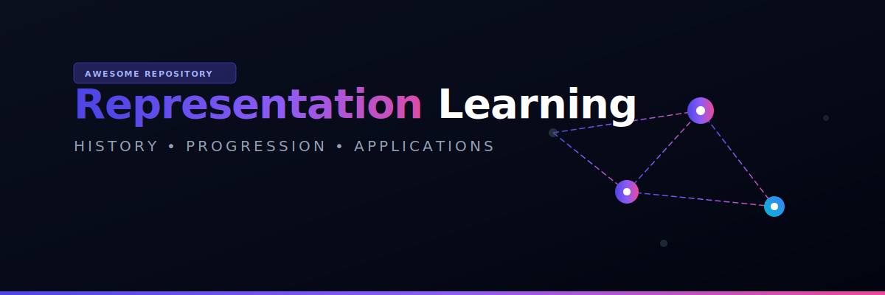
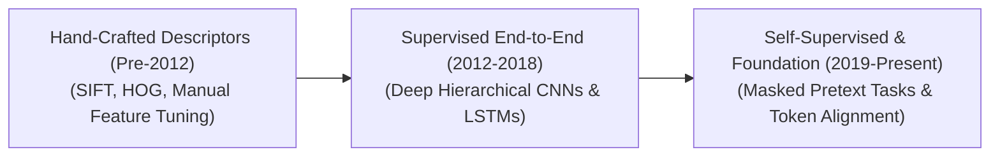

# 🧠 Awesome-Representation-Learning

<meta name="description" content="A comprehensive curated resources list on Representation Learning: history, micro/macro chronological progressions, discriminative/contrastive models, and real-world applications." />

## 🌌 Representation Learning: History, Progression, Variants, & Applications

Representation Learning—also known as Feature Learning—is a foundational paradigm in Artificial Intelligence dedicated to automatically discovering, extracting, and structuring meaningful patterns from raw, uncurated input data (such as raw pixels, text characters, acoustic waves, or molecular coordinates). Traditionally, machine learning pipelines depended entirely on **Hand-Crafted Feature Engineering**, a process where human domain experts spent years manually designing mathematical extractors (e.g., edge filters for images or specific syntax frequencies for text). Representation Learning shifts this burden completely to the algorithm: by passing raw data through deep, hierarchical neural layers, the network independently transforms chaotic data fields into compact, lower-dimensional continuous vectors (embeddings) that isolate the underlying semantic and geometric coordinates of the data space.

---

## 📈 1. The Macro Chronological Evolution

The historical trajectory of Representation Learning reflects a structural progression away from rigid, human-engineered descriptors to end-to-end deep spatial hierarchies, multi-modal contrastive spaces, and unified self-supervised token systems.

| Era / Concept | Details | Year | Reference Paper |
| :--- | :--- | :--- | :--- |
| [**The Hand-Crafted Feature Engineering Era (Traditional ML, Pre-2012)**](details/hand_crafted_feature_engineering.md) | **Concept:** The structural baseline. Machine learning models were decoupled from data perception. Human engineers calculated explicit feature statistics manually—such as using **SIFT (1999)** or **HOG (2005)** to isolate visual contours, or executing Term Frequency-Inverse Document Frequency (TF-IDF) calculations over text. These static vectors were then routed to simple linear classifiers like Support Vector Machines (SVMs).  **Limitation:** Extremely labor-intensive and fragile. Features were incapable of adapting dynamically to minor environmental lighting changes, text typos, background noise, or contextual shifts. | 1999 | [Lowe (1999)](https://doi.org/10.1109/ICCV.1999.790410) |
| [**The Supervised Deep Hierarchical Era (~2012–2018)**](details/supervised_deep_hierarchical.md) | **Concept:** Sparked by the historic performance of **AlexNet (2012)** on ImageNet. Proved that deep convolutional networks could learn features *natively* from end-to-end backpropagation. Deep layers learned features hierarchically: early blocks extracted raw, low-level edges and blobs, intermediate blocks assembled them into textures and shapes, and terminal layers mapped them to complex semantic concepts (e.g., full animal parts or vehicle faces).  **Limitation:** Reliant on massive, expensive, and human-annotated supervised datasets (like millions of cleanly labeled images or text transcripts), capping architectural scaling bounds. | 2012 | [Krizhevsky et al. (2012)](https://papers.nips.cc/paper/2012/hash/c3910ee4e3a50448025055fd39965821-Abstract.html) |
| [**The Self-Supervised Foundation & Joint-Embedding Era (~2019–Present)**](details/self_supervised_foundation.md) | **Concept:** The current modern state-of-the-art infrastructure baseline. It completely removes human labels by executing **Self-Supervised Learning (SSL)** over web-scale uncurated data corpuses. By designing clever "pretext tasks"—such as randomly mask-hiding text tokens (**BERT/GPT**), deleting visual image patches (**MAE**), or matching cross-modal vectors (**CLIP/SigLIP**)—the network forces its internal layers to develop an advanced, universal, and zero-shot understanding of language, physics, and spatial geometries natively. | 2018 | [BERT: Devlin et al. (2018)](https://arxiv.org/abs/1810.04805) |

---

## 🔬 2. Core Functional & Algorithmic Variants

Representation learning frameworks are strictly categorized based on the underlying mathematical loss functions and geometric structures they deploy to organize the latent space.

| Variant | Details | Year | Reference Paper |
| :--- | :--- | :--- | :--- |
| [**A. Supervised Discriminative Representation**](details/supervised_discriminative.md) | **Mechanism:** Maps input objects into discrete categorical zones guided by human-annotated target labels. The network calculates a Softmax cross-entropy loss over a fixed index of classes, pulling identical categories together while driving separate classes apart.  **Application:** Standard layout for specialized classification networks (e.g., ResNet, early vision models). | 2012 | [Krizhevsky et al. (2012)](https://papers.nips.cc/paper/2012/hash/c3910ee4e3a50448025055fd39965821-Abstract.html) |
| [**B. Contrastive Joint-Embedding Representation (CLIP/SimCLR)**](details/contrastive_joint_embedding.md) | **Mechanism:** Formulates feature extraction as a multi-dimensional semantic alignment task. It pairs an input with an alternative view or another modality (e.g., an image matched with its text caption), applying the **InfoNCE or Sigmoid loss function** to maximize the vector dot product of matched pairs while aggressively repelling mismatched pairs.  **Pros:** Natively unlocks open-vocabulary zero-shot classification and cross-modal semantic search, mapping text and pixels into a single shared coordinate sphere. | 2020 | [SimCLR: Chen et al. (2020)](https://arxiv.org/abs/2002.05709) |
| [**C. Predictive Autoencoding / Reconstruction (MAE/BERT)**](details/predictive_autoencoding.md) | **Mechanism:** Randomly masks or deletes up to 15% to 75% of incoming sequence tokens or visual pixel patches. The model's hidden layers must exploit surrounding structural boundaries, context clues, and spatial rules to mathematically reconstruct the original missing parameters.  **Pros:** The primary engine driving modern foundation models, forcing the network to internalize robust real-world logic patterns without manual human tagging loops. | 2018 | [BERT: Devlin et al. (2018)](https://arxiv.org/abs/1810.04805) |
| [**D. Information-Maximization (Non-Contrastive / VICReg)**](details/information_maximization.md) | **Mechanism:** Bypasses negative samples entirely to prevent representation space collapse (where the model maps all inputs to a single static vector). It applies strict variance-covariance regularization constraints across the embedding dimensions.  **Pros:** Mathematically forces the network to utilize its entire latent channel capacity, decorrelating dimensions to ensure highly diverse feature extraction. | 2021 | [VICReg: Bardes et al. (2021)](https://arxiv.org/abs/2105.04906) |

---

## 🗂️ 3. High-Capacity Architectural & Token Modalities

Depending on the operational constraints of the AI pipeline, representations are structured across distinct geometric paradigms.

| Paradigm / Modality | Details | Year | Reference Paper |
| :--- | :--- | :--- | :--- |
| [**Continuous Latent Vector Spaces (Embeddings)**](details/continuous_latent_vector.md) | **Profile:** Projects data into a smooth, high-dimensional continuous hypersphere (e.g., 512, 768, or 4096 dimensions). Distance metrics (like Cosine Similarity or Normalized Euclidean distance) indicate relative semantic affinity. | 2013 | [Word2Vec: Mikolov et al. (2013)](https://arxiv.org/abs/1301.3781) |
| [**Discrete Codebook Quantization (VQGAN Class)**](details/discrete_codebook_quantization.md) | **Profile:** Serializes continuous vectors by snapping them to their nearest neighbor inside a discrete codebook matrix using a Straight-Through Estimator (STE). This turns an image or audio waveform into a sequence of discrete numerical tokens, allowing standard autoregressive Transformers to read it like language. | 2017 | [VQ-VAE: van den Oord et al. (2017)](https://arxiv.org/abs/1711.00937) |
| [**Monosemantic Feature Dictionaries (Sparse Autoencoders)**](details/monosemantic_feature_dictionaries.md) | **Profile:** Repurposed for Mechanistic Interpretability. It maps the highly compressed, intertwined hidden states of active transformers (superposition) out into an overcomplete sparse matrix containing millions of units, isolating highly specific, human-auditable "concept neurons" cleanly. | 2023 | [Bricken et al. (2023)](https://transformer-circuits.pub/2023/monosemantic-features/index.html) |

---

## ⚙️ 4. Production Engineering Challenges & Hardware Solutions

Deploying and scaling representation learning frameworks across industrial infrastructure configurations introduces intense memory-bus and optimization bottlenecks.

| Challenge | Details | Year | Reference Paper |
| :--- | :--- | :--- | :--- |
| [**The Representation Collapse Trap**](details/representation_collapse_trap.md) | **Problem:** During self-supervised training passes, if the model discovers that outputting a single constant vector (e.g., all zeros) for *every* input view minimizes the contrastive loss function mathematically, it will freeze there, completely halting the learning process.  **Mitigation:** Implementing **asymmetric architectures** (adding a predictor MLP to only one branch), utilizing strict **stop-gradient operations**, or enforcing **identity covariance constraints (Barlow Twins)** to preserve dimension usage. | 2021 | [Barlow Twins: Zbontar et al. (2021)](https://arxiv.org/abs/2103.03230) |
| [**The Quadratic Visual Token Explosion**](details/quadratic_visual_token_explosion.md) | **Problem:** Processing high-resolution images or multi-page documents inside Vision Transformers requires slicing data into fine-grained visual patches. This creates thousands of active patch tokens, causing the model's internal self-attention matrix calculation to hit a quadratic ($O(N^2)$) memory footprint wall, triggering system crashes.  **Mitigation:** Implementing **FlashAttention hardware-aware register fusion**, coupled with **Dynamic Resolution Patching (AnyRes)** to process coarse thumbnails interleaved with focused sub-patches concurrently. | 2022 | [FlashAttention: Dao et al. (2022)](https://arxiv.org/abs/2205.14135) |

---

## 🚀 5. Frontier Real-World AI Applications

| Frontier Application | Details | Year | Reference Paper |
| :--- | :--- | :--- | :--- |
| [**Pre-Training Web-Scale Multi-Modal Foundation LLMs**](details/pretraining_web_scale_multimodal.md) | **Application:** Serves as the default cognitive engine driving modern multi-modal systems (e.g., Llama, GPT-4o, Claude). Unsupervised autoregressive next-token and visual patch representation learning allows the model to naturally internalize world facts, complex programming syntaxes, and cross-sensory logic patterns concurrently. | 2021 | [CLIP: Radford et al. (2021)](https://arxiv.org/abs/2103.00020) |
| [**Real-Time Cyber-Security Anomaly & Fraud Detection Platforms**](details/realtime_cybersecurity_anomaly.md) | **Application:** Screens millions of high-frequency banking or system transaction logs in real time. Deep reconstruction autoencoders and contrastive models learn the exact multi-dimensional parameters of "normal" system behavior, instantly flagging and isolating cyber-attacks or money laundering vectors if an execution deviates from the learned manifold. | 2002 | [RNN Outliers: Hawkins et al. (2002)](https://link.springer.com/chapter/10.1007/3-540-46146-9_16) |
| [**De Novo Bio-Informatics & Genetic Structural Discovery**](details/denovo_bioinformatics.md) | **Application:** Maps unannotated DNA, RNA, or protein peptide sequences spanning billions of elements. Self-supervised representation learning layers (such as AlphaFold variants) group complex molecules by structural geometry, accelerating target-specific drug discovery and tracking evolutionary mutations with high precision. | 2021 | [AlphaFold: Jumper et al. (2021)](https://www.nature.com/articles/s41586-021-03819-2) |

---

## 📚 References
1. Lowe, D. G. (1999). Object recognition from local scale-invariant features. *Proceedings of the Seventh IEEE International Conference on Computer Vision*, 2, 1150-1157.
2. Dalal, N., & Triggs, B. (2005). Histograms of oriented gradients for human detection. *IEEE Computer Society Conference on Computer Vision and Pattern Recognition (CVPR)*, 1, 886-893.
3. Krizhevsky, A., Sutskever, I., & Hinton, G. E. (2012). ImageNet classification with deep convolutional neural networks. *Advances in Neural Information Processing Systems (NeurIPS)*, 25, 1097-1105.
4. Chen, T., et al. (2020). A simple framework for contrastive learning of visual representations. *International Conference on Machine Learning (ICML)*, 1597-1607.
5. He, K., et al. (2022). Masked autoencoders are scalable vision learners. *Proceedings of the IEEE/CVF Conference on Computer Vision and Pattern Recognition (CVPR)*, 16000-10609.
6. Radford, A., et al. (2021). Learning transferable visual models from natural language supervision. *International Conference on Machine Learning (ICML)*, 8748-8763.
7. Bardes, J., Ponce, J., & LeCun, Y. (2022). VICReg: Variance-covariance-invariance regularization for self-supervised learning. *International Conference on Learning Representations (ICLR)*.

---

To advance this documentation repository, structural setup, or architectural deployment pipeline, consider exploring these adjacent development pathways:
* Build a **Python code snippet using PyTorch** illustrating how to implement a basic InfoNCE contrastive loss loop over a pair of forward-pass embedding tensors.

##  Star History

<a href="https://www.star-history.com/?repos=ishandutta2007%2FAwesome-Representation-Learning&type=date&legend=bottom-right">
<picture>
<source media="(prefers-color-scheme: dark)" srcset="https://api.star-history.com/chart?repos=ishandutta2007/Awesome-Representation-Learning&type=date&theme=dark&legend=bottom-right" />
<source media="(prefers-color-scheme: light)" srcset="https://api.star-history.com/chart?repos=ishandutta2007/Awesome-Representation-Learning&type=date&legend=bottom-right" />

</picture>
</a>

