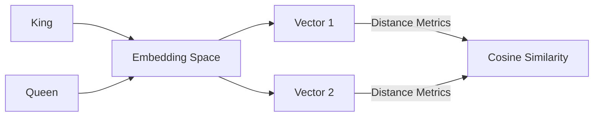

# Continuous Latent Vector Spaces (Embeddings)

## Overview
Projects inputs into a continuous high-dimensional vector space where semantic distance corresponds to mathematical distance measures like cosine similarity.

## Representation Flow / Architecture

---
[← Back to README](../README.md)
