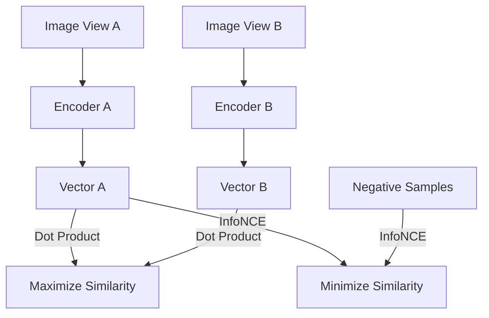

# Contrastive Joint-Embedding Representation (CLIP/SimCLR)

## Overview
Formulates feature extraction as a multi-dimensional semantic alignment task. Using InfoNCE or Sigmoid loss, it maximizes similarity for positive pairs while repelling negative pairs.

## Representation Flow / Architecture

---
[← Back to README](../README.md)
