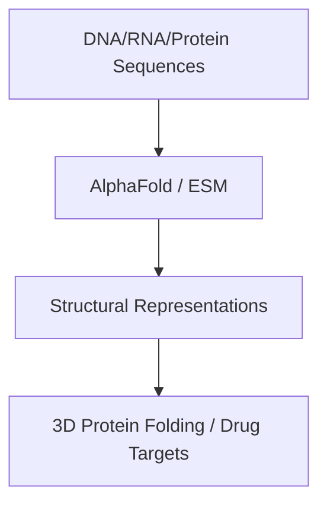

# De Novo Bio-Informatics & Genetic Structural Discovery

## Overview
Self-supervised representation learning models map sequence details of DNA, RNA, and proteins to accelerate genetic structural discovery and target drug designs.

## Representation Flow / Architecture

---
[← Back to README](../README.md)
