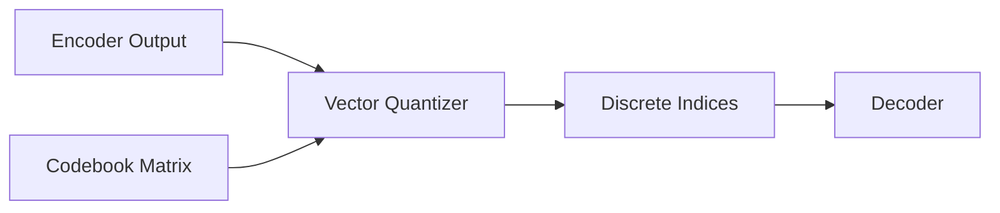

# Discrete Codebook Quantization (VQGAN Class)

## Overview
Snaps continuous latent vectors to their nearest neighbors inside a codebook matrix, producing discrete tokens that can be read sequentially like words.

## Representation Flow / Architecture

---
[← Back to README](../README.md)
