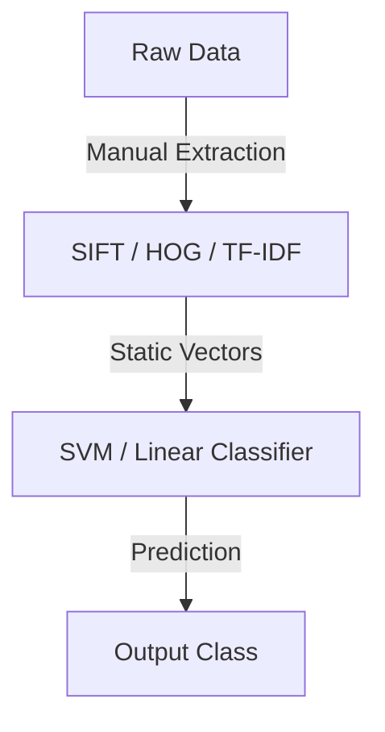

# Hand-Crafted Feature Engineering

## Overview
Traditional machine learning pipelines relied heavily on manual feature engineering. Domain experts designed mathematical extractors (like SIFT for contours or HOG for shapes) to capture specific patterns in data.

## Representation Flow / Architecture

---
[← Back to README](../README.md)
