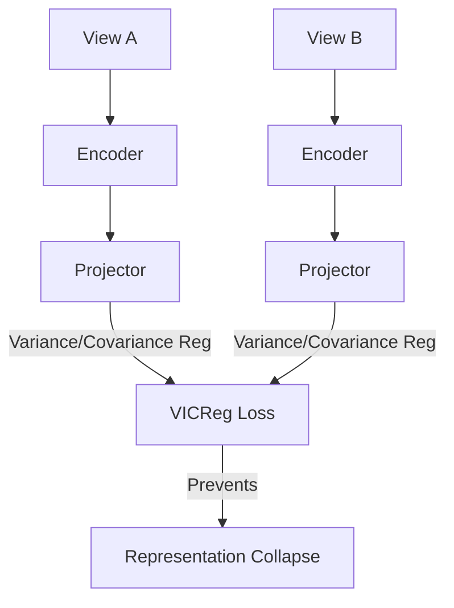

# Information-Maximization (Non-Contrastive / VICReg)

## Overview
Information-Maximization methods (like VICReg) bypass negative samples entirely and prevent representation collapse by regularizing variance and covariance of the embedding dimensions.

## Representation Flow / Architecture

---
[← Back to README](../README.md)
