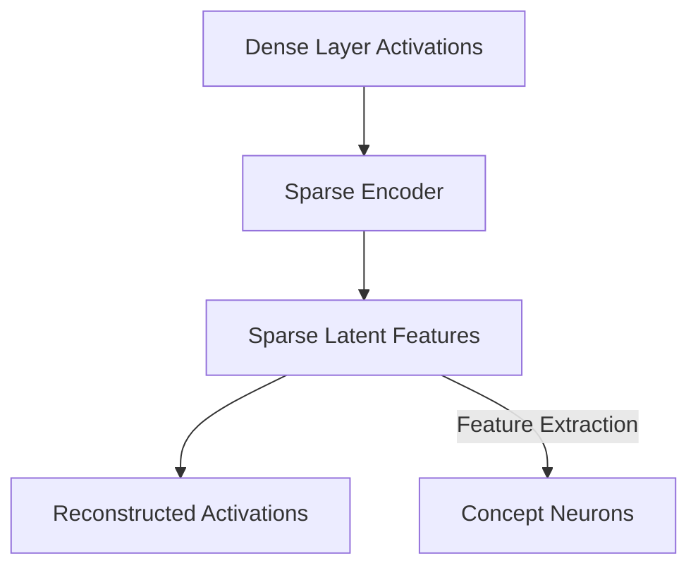

# Monosemantic Feature Dictionaries (Sparse Autoencoders)

## Overview
Decomposes superposition-affected hidden states of transformers into sparse, overcomplete representations to isolate human-interpretable concepts.

## Representation Flow / Architecture

---
[← Back to README](../README.md)
