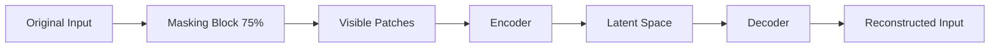

# Predictive Autoencoding / Reconstruction (MAE/BERT)

## Overview
Predictive autoencoding works by masking a portion of the input tokens or patches and training the model to reconstruct the missing details using surrounding contextual info.

## Representation Flow / Architecture

---
[← Back to README](../README.md)
