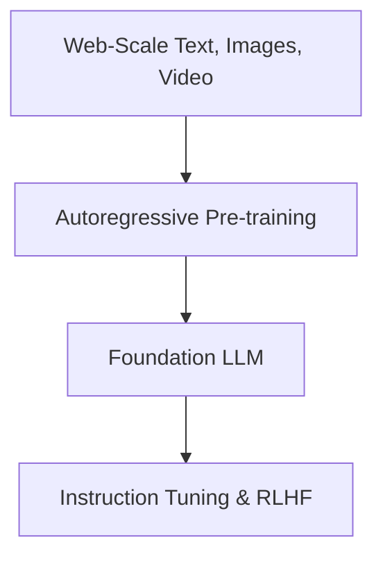

# Pre-Training Web-Scale Multi-Modal Foundation LLMs

## Overview
Pre-training multi-modal foundation models on web-scale datasets enables them to learn cross-modal alignments, reasoning capabilities, and facts natively.

## Representation Flow / Architecture

---
[← Back to README](../README.md)
