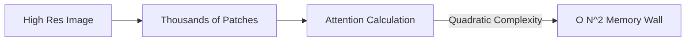

# The Quadratic Visual Token Explosion

## Overview
Processing high-resolution visual inputs creates a massive token count, causing self-attention memory usage to scale quadratically O(N^2) and causing memory bottlenecks.

## Representation Flow / Architecture

---
[← Back to README](../README.md)
