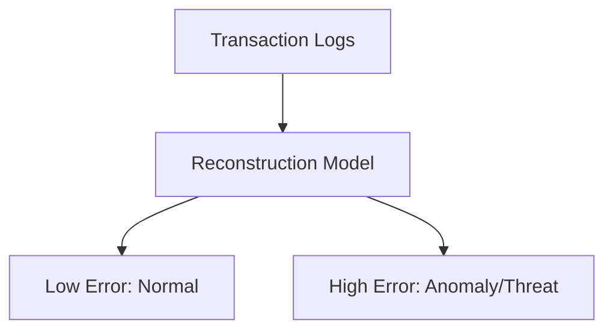

# Real-Time Cyber-Security Anomaly & Fraud Detection Platforms

## Overview
By learning the manifolds of normal transaction logs, deep autoencoders and contrastive models can detect anomalies and cybersecurity threats in real time.

## Representation Flow / Architecture

---
[← Back to README](../README.md)
