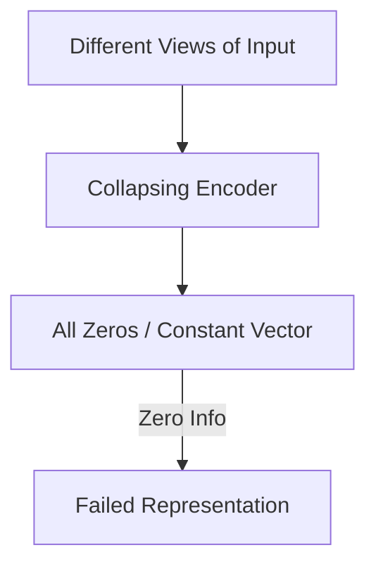

# The Representation Collapse Trap

## Overview
A failure mode in self-supervised learning where the encoder maps all inputs to a constant vector to minimize the loss function.

## Representation Flow / Architecture

---
[← Back to README](../README.md)
