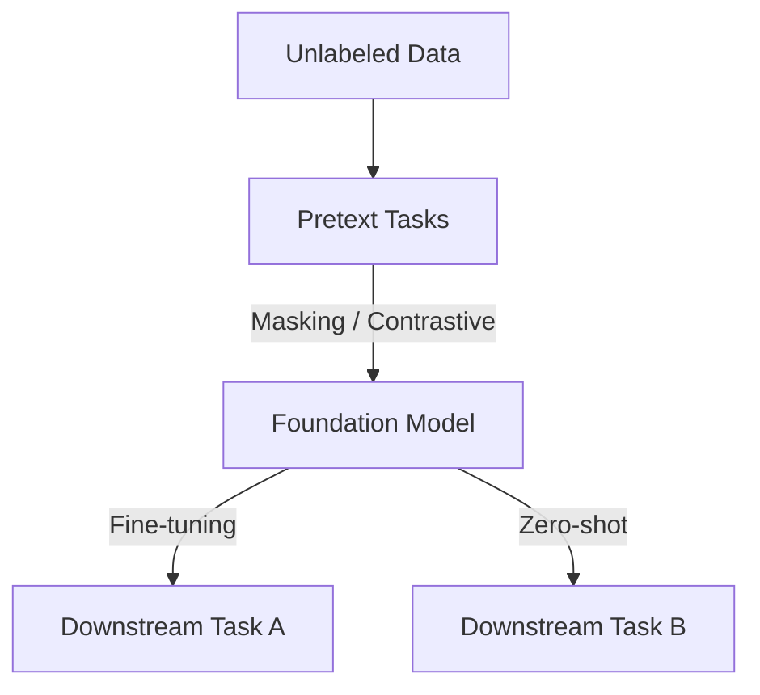

# Self-Supervised Foundation & Joint-Embedding

## Overview
Self-Supervised Learning (SSL) utilizes raw, unlabeled data by creating artificial pretext tasks (like masking tokens or contrasting views) to train large foundation models.

## Representation Flow / Architecture

---
[← Back to README](../README.md)
