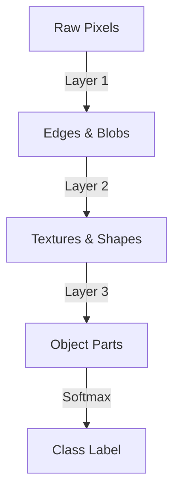

# Supervised Deep Hierarchical Era

## Overview
Deep Convolutional Networks and Recurrent Networks learn hierarchical representations natively through backpropagation on labeled datasets. Early layers capture basic features like edges, intermediate layers capture textures, and deep layers capture semantics.

## Representation Flow / Architecture

---
[← Back to README](../README.md)
