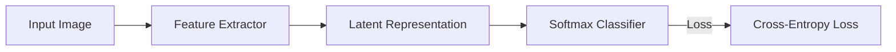

# Supervised Discriminative Representation

## Overview
Supervised discriminative representation maps input objects into distinct categories using softmax cross-entropy loss, pulling similar classes together and pushing dissimilar classes apart.

## Representation Flow / Architecture

---
[← Back to README](../README.md)
